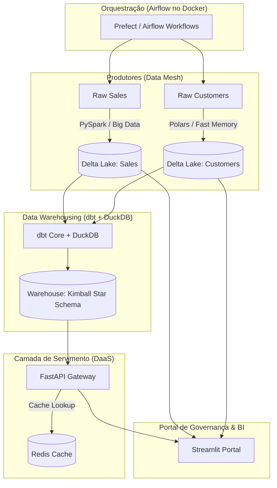

# Enterprise Data Mesh & Lakehouse (Delta Lake + Airflow + dbt + DuckDB + FastAPI + Redis)

Este projeto implementa uma **Plataforma de Dados de Nível de Excelência (Staff/Lead)**, utilizando o paradigma de **Data Mesh** (domínios descentralizados expostos como produtos de dados), armazenamento colunar transacional (**Lakehouse com Delta Lake**), engenharia de analytics (**dbt + DuckDB**), servimento performático (**FastAPI + cache de consultas com Redis**) e orquestração industrial (**Apache Airflow**).

---

## 🏗️ Arquitetura de Referência da Plataforma



---

## 🛠️ Stack Tecnológica & Justificativa

1.  **Apache Airflow (Docker Compose)**: Orquestrador líder de mercado, gerenciando tarefas paralelas em containers isolados com controle de dependências.
2.  **PySpark (E-Commerce Sales)**: Processamento distribuído de alto rendimento simulando Big Data, gravando dados particionados por `status`.
3.  **Polars (CRM Customers)**: Motor de DataFrames em Rust ultra-rápido para processamento eficiente em memória de cadastros estruturados.
4.  **Delta Lake (Lakehouse)**: Armazenamento analítico colunar baseado em Parquet com suporte a transações ACID, controle de versão (Time Travel) e garantia de esquemas.
5.  **dbt Core & DuckDB**: Criação de tabelas de Dimensões, Fatos e KPI Marts analíticos em modelagem dimensional Star Schema.
6.  **FastAPI (DaaS API Gateway)**: Exposição de dados analíticos via endpoints HTTP estruturados, isolando o banco de dados direto de acessos terceiros.
7.  **Redis (Caching Layer)**: Armazenamento chave-valor em memória cacheando resultados analíticos da API com TTL (Time-To-Live) para latências inferiores a 3ms.
8.  **Pydantic v2 (Data Contracts)**: Validação rígida de esquemas na entrada do pipeline. Qualquer dado corrompido é enviado para a quarentena de auditoria.
9.  **Streamlit (Portal & Time Travel Slider)**: Interface de visualização que integra catálogo de governança, gráfico de KPIs e um comparador de histórico de commits do Delta Lake com suporte a Rollback/Restore físico por cliques.

---

## 🚀 Como Executar o Projeto (Passo a Passo)

### Passo 1: Iniciar o Docker Desktop
O Docker Desktop deve estar aberto e ativo na sua máquina. Abra-o manualmente para que o daemon do Docker seja inicializado.

---

### Passo 2: Subir a Infraestrutura de Containers
Abra um terminal PowerShell na pasta raiz do projeto e execute:

```powershell
docker compose up -d --build
```

Isso iniciará:
*   `postgres`: Banco de metadados do Airflow.
*   `redis`: Servidor de caching de consultas analíticas (porta `6379`).
*   `minio`: Servidor de S3 local (porta `9000` e Console na `9001`).
*   `airflow-webserver` e `airflow-scheduler`: Orquestrador Airflow (porta `8085` com usuário `airflow` / senha `airflow`).

---

### Passo 3: Configurar o Ambiente Python Local
Com os containers rodando, crie o ambiente virtual local para rodar a API e o painel Streamlit:

```powershell
./setup.ps1
```

Ative a virtualenv criada:
```powershell
.venv\Scripts\activate.ps1
```

---

### Passo 4: Executar a API Gateway (FastAPI)
No terminal com a virtualenv ativa, execute o servidor da API:

```powershell
uvicorn app.main:app --reload --port 8000
```
*   A documentação Swagger da API estará ativa em: 👉 **[http://localhost:8000/docs](http://localhost:8000/docs)**.

---

### Passo 5: Executar o Portal de Governança (Streamlit)
Em um novo terminal (com a virtualenv ativa), execute:

```powershell
streamlit run portal.py
```
*   O painel abrirá em: 👉 **[http://localhost:8501](http://localhost:8501)**.

---

### Passo 6: Orquestrar e Executar no Airflow
1.  Acesse o Airflow Webserver em 👉 **[http://localhost:8085](http://localhost:8085)** (credenciais: `airflow` / `airflow`).
2.  Localize a DAG **`enterprise_data_mesh_pipeline`**.
3.  Ative a DAG e clique no botão **Trigger DAG** (play) para executar o pipeline completo:
    - `crm_customers_ingestion` e `ecommerce_sales_ingestion` serão executadas em paralelo.
    - A ingestão lerá os arquivos JSON mock da pasta `storage/raw`, validará os esquemas contra os contratos Pydantic, isolará erros na pasta de quarentena, e salvará os válidos no Delta Lake.
    - Uma vez concluídos com sucesso, o `dbt_warehouse_build` executará o `dbt build` compilando o Data Warehouse dimensional final.

---

## 🕰️ Testando os Recursos "Outro Nível"

### 1. Travas de Contratos e Quarentena (Data Contracts)
Ao abrir a pasta `storage/raw`, você verá que o script de setup gerou dados mock. Dois registros intencionalmente quebram os contratos de dados (ex: e-mail sem `@` no CRM e valor de venda negativo no E-Commerce).
- Ao final da execução da DAG no Airflow, inspecione a aba **Catálogo Data Mesh & Contratos** no Streamlit para visualizar os detalhes exatos do erro e os arquivos enviados para a quarentena.

### 2. Time Travel & Rollback de Dados
Na aba **Delta Lake Time Travel** do Streamlit:
1.  Visualize o histórico de commits físicos das suas tabelas.
2.  Use o slider de versões para ver os dados exatamente como eram no passado.
3.  Faça novos disparos no Airflow para gerar commits.
4.  Selecione uma versão anterior no slider e clique no botão **Executar Restore**. O Delta Lake reverterá o estado físico da tabela instantaneamente!

### 3. Caching de Consultas com Redis
Na aba **BI Dashboard** do Streamlit:
1.  Clique no botão **Consultar API (Sem Caching)**: o FastAPI executará a consulta diretamente no DuckDB. Note o tempo de latência de resposta.
2.  Clique no botão **Consultar API (Com Caching)**: o FastAPI lerá os dados do cache em memória do Redis. A latência despencará para frações de milissegundos!
