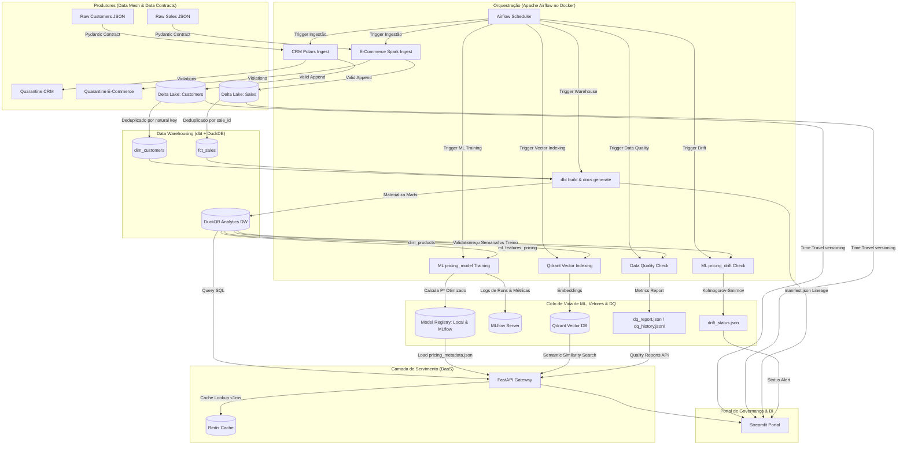

# Enterprise Data Mesh & Lakehouse Platform (Delta Lake + Airflow + dbt + DuckDB + FastAPI + Redis + MLflow + Qdrant + Data Quality)

Este projeto implementa uma **Plataforma de Dados de Nível de Produtividade Industrial (Lead/Staff Data Engineer & MLOps)**. Ela utiliza o paradigma de **Data Mesh** (domínios descentralizados expostos como produtos de dados), armazenamento colunar transacional (**Lakehouse com Delta Lake**), engenharia de analytics (**dbt Core + DuckDB**), servimento performático (**FastAPI + cache Redis**), modelagem e ciclo de vida de ML (**MLflow + Random Forest + Drift Monitor**), busca semântica vetorial (**Qdrant + FastEmbed**), observabilidade de qualidade de dados (**Data Quality Engine**) e orquestração automatizada (**Apache Airflow**).

---

## 🏗️ Arquitetura de Referência da Plataforma



---

## 🛠️ Stack Tecnológica & Justificativa

1. **Apache Airflow (Docker Compose)**: Orquestrador líder de mercado, gerenciando tarefas paralelas em containers isolados com controle de dependências.
2. **PySpark (E-Commerce Sales)**: Processamento distribuído de alto rendimento simulando Big Data, gravando dados particionados por `status`.
3. **Polars (CRM Customers)**: Motor de DataFrames em Rust ultra-rápido para processamento eficiente em memória de cadastros estruturados.
4. **Delta Lake (Lakehouse)**: Armazenamento analítico colunar transacional com suporte a transações ACID, versionamento de dados (Time Travel) e evolução de esquema (`mergeSchema`).
5. **dbt Core & DuckDB**: Criação de Dimensões, Fatos (Kimball Star Schema) e KPI Marts analíticos, além de geração automática de documentação e grafo de linhagem.
6. **FastAPI (DaaS API Gateway)**: Exposição de dados analíticos via endpoints HTTP estruturados, isolando o banco de dados direto de acessos de terceiros.
7. **Redis (Caching Layer)**: Armazenamento chave-valor em memória cacheando resultados analíticos da API com TTL para latências inferiores a 1ms.
8. **Pydantic v2 (Data Contracts)**: Validação rígida de esquemas na entrada do pipeline. Qualquer dado corrompido é enviado para a quarentena de auditoria.
9. **MLflow Tracking**: Servidor centralizado para controle de ciclo de vida de modelos, logging de parâmetros, métricas de regressão ($R^2$ e MAE) e artefatos de treinamento.
10. **Evitação de Drift & Time Travel**: Análise estatística de desvio de dados (Kolmogorov-Smirnov Test) e suporte a carregamento de dados históricos do Delta Lake para retreino retroativo reprodutível.
11. **Streamlit (Portal BI & Governança)**: Interface de visualização que integra catálogo de governança, lineage dbt dinâmico via Graphviz, monitoramento de drift de ML, gráficos de KPIs, comparador de histórico de commits do Delta Lake com suporte a Rollback físico, busca semântica vetorial e observabilidade de Data Quality.
12. **Qdrant & FastEmbed**: Banco de dados vetorial corporativo (Qdrant) integrado com pipeline leve de embeddings em ONNX (FastEmbed) para buscas semânticas em linguagem natural no catálogo de produtos.
13. **Data Quality Observability**: Motor customizado de qualidade de dados integrado no Airflow e DuckDB para monitorar anomalias de faturamento, integridade referencial, volume diário e quedas bruscas de vendas.

---

## 🚀 Como Executar o Projeto (Passo a Passo)

### Passo 1: Iniciar o Docker Desktop
O Docker Desktop deve estar aberto e ativo na sua máquina. Abra-o manualmente para que o daemon do Docker seja inicializado.

---

### Passo 2: Subir a Infraestrutura de Containers
Abra um terminal PowerShell na pasta raiz do projeto e execute:

```powershell
docker compose up -d --build
```

Isso iniciará:
* `postgres`: Banco de metadados do Airflow.
* `redis`: Servidor de caching de consultas analíticas (porta `6389`).
* `minio`: Servidor de S3 local (porta `9000` / Console na `9001`).
* `mlflow`: Servidor de rastreamento de modelos e experimentos de ML (porta `5001` exposta).
* `airflow-webserver` e `airflow-scheduler`: Orquestrador Airflow (porta `8085` com usuário `airflow` / senha `airflow`).

---

### Passo 3: Configurar o Ambiente Python Local
Com os containers rodando, crie o ambiente virtual local para rodar a API, o painel Streamlit e os testes unitários:

```powershell
./setup.ps1
```

Ative a virtualenv criada:
```powershell
.venv\Scripts\activate.ps1
```

---

### Passo 4: Executar os Testes Automatizados (CI/CD)
Para rodar a bateria de testes unitários que valida a integridade de dados e conformidade com os contratos Pydantic localmente:

```powershell
pytest tests/
```

---

### Passo 5: Executar a API Gateway (FastAPI)
No terminal com a virtualenv ativa, execute o servidor da API:

```powershell
uvicorn app.main:app --reload --port 8000
```
* A documentação Swagger da API estará ativa em: 👉 **[http://localhost:8000/docs](http://localhost:8000/docs)**.
* Endpoint de ML (Preço Ótimo sugerido com cache Redis): `GET http://localhost:8000/api/v1/predict/optimal-price?product_name=Fone%20Sony%20WH-1000XM4`

---

### Passo 6: Executar o Portal de Governança (Streamlit)
Em um novo terminal (com a virtualenv ativa), execute:

```powershell
streamlit run portal.py
```
* O painel abrirá em: 👉 **[http://localhost:8501](http://localhost:8501)**.

---

### Passo 7: Orquestrar e Executar no Airflow
1. Acesse o Airflow Webserver em 👉 **[http://localhost:8085](http://localhost:8085)** (credenciais: `airflow` / `airflow`).
2. Localize a DAG **`enterprise_data_mesh_pipeline`**.
3. Ative a DAG e clique no botão **Trigger DAG** (play) para executar o pipeline completo:
   - `crm_customers_ingestion` e `ecommerce_sales_ingestion` serão executadas em paralelo.
   - O `dbt_warehouse_build` executará o `dbt build && dbt docs generate` gerando os modelos analíticos e metadados.
   - Em paralelo downstream, `ml_pricing_training` e `ml_pricing_drift_check` treinarão o regressor, registrarão no MLflow e avaliarão se há desvio de preços recente.

---

## 🕰️ Testando os Recursos "Outro Nível"

### 1. MLflow Tracking UI
Acesse 👉 **[http://localhost:5001](http://localhost:5001)** para verificar o painel de experimentos. Toda vez que o modelo é retreinado via Airflow:
* Um run é criado na plataforma "Dynamic Pricing Optimization".
* Hiperparâmetros, R2 Score, MAE e o arquivo de metadados JSON de otimização de preços são salvos e versionados automaticamente como artefatos.

### 2. Linhagem dbt Dinâmica (Lineage Graph)
Acesse a aba **Catálogo Data Mesh & Contratos** no Streamlit para visualizar o grafo de dependências compilado em tempo real a partir de `manifest.json`. O portal lê as dependências e renderiza os fluxos de dados de Staging, Dimensões, Fatos e ML Features com cores customizadas utilizando Graphviz.

### 3. Monitoramento de Data Drift
Acesse a aba **MLOps: Precificação Dinâmica** no Streamlit. O portal exibe um alerta de status:
* **Verde**: Caso as distribuições de preços recentes (últimos 15 dias) estejam estáveis.
* **Vermelho**: Caso o Kolmogorov-Smirnov teste identifique desvio estatístico de preços ($p\text{-value} < 0.05$), alertando a necessidade de retreinar o pipeline por mudança de comportamento do mercado.

### 4. Time Travel & Rollback de Dados
Na aba **Delta Lake Time Travel** do Streamlit:
1. Visualize o histórico de commits físicos das suas tabelas.
2. Use o slider de versões para ver os dados exatamente como eram no passado.
3. Clique em **Executar Restore** para reverter a tabela física Delta para a versão selecionada instantaneamente!

### 5. Busca Semântica Vetorial de Produtos
Na aba **Busca Semântica Vetorial** do Streamlit:
1. Faça buscas em linguagem natural (ex: "dispositivo para programar" ou "teclado brown").
2. Veja o score de similaridade cosseno (calculado via FastEmbed/ONNX em tempo real e indexado no Qdrant).
3. Consulte as métricas integradas de otimização de preços de ML para cada produto retornado.
4. Visualize o log histórico de buscas com controle interativo de limites para identificar lacunas de catálogo (Catalog Gaps).

### 6. Observabilidade de Data Quality
Na aba **Observabilidade de Data Quality** do Streamlit:
1. Veja o score de conformidade geral da plataforma em lote (100% Passed).
2. Acompanhe a linha do tempo histórica de conformidade alimentada diretamente pelas DAGs do Airflow.
3. Audite anomalias complexas:
   * **Desvio de Preço Concorrente**: Flutuações maiores que 50% em relação aos nossos preços.
   * **Anomalia de Queda de Vendas**: Detecção imediata se algum produto teve vendas zeradas nos últimos 3 dias.
   * **Registros Órfãos (Completeness)**: Proporção de vendas sem clientes associados (órfãos).
   * **Anomalia de Volume Diário**: Alerta se o volume do último dia desviar em mais de 2 desvios padrões da média histórica.

