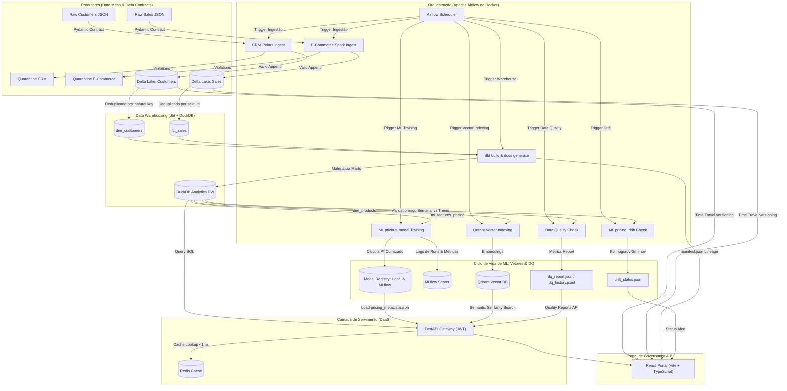

# Enterprise Data Mesh & Lakehouse Platform

**Delta Lake · Airflow · dbt · DuckDB · FastAPI · Redis · MLflow · Qdrant · Claude (LLM) · React + TypeScript**

Este projeto implementa uma **Plataforma de Dados e IA de Nível de Produtividade Industrial (Data Engineering + AI Engineering)**. Ela utiliza o paradigma de **Data Mesh** (domínios descentralizados expostos como produtos de dados), armazenamento colunar transacional (**Lakehouse com Delta Lake**), engenharia de analytics (**dbt Core + DuckDB**), servimento performático (**FastAPI + cache Redis**), modelagem e ciclo de vida de ML (**MLflow + Random Forest + Drift Monitor**), busca semântica vetorial (**Qdrant + FastEmbed**), um **AI Copilot com LLM (Claude) orquestrado via tool use** — text-to-SQL com guardrails e RAG sobre o catálogo —, observabilidade de qualidade de dados (**Data Quality Engine**), orquestração automatizada (**Apache Airflow**) e um **Portal de Governança em React + TypeScript** consumindo tudo via API autenticada com JWT.

---

## 🔄 Ciclo de Vida da Engenharia de Dados

A plataforma foi desenhada seguindo o ciclo de vida clássico da engenharia de dados (Reis & Housley, *Fundamentals of Data Engineering*), com cada estágio e elemento subjacente mapeado para um componente concreto:

| Estágio / Elemento | Implementação na Plataforma |
|---|---|
| **Geração** | Fontes simuladas de CRM e E-Commerce (`domains/generate_mock_data.py`) produzindo JSONs brutos |
| **Ingestão** | Polars (CRM) e PySpark (E-Commerce) com **Data Contracts Pydantic** e quarentena de violações |
| **Transformação** | dbt Core sobre DuckDB — staging → dimensões/fatos (Kimball) → marts de KPI, LTV/RFM e features de ML, com **modelo incremental** (`fct_sales`) e **snapshot SCD Type 2** de clientes |
| **Disponibilização** | FastAPI (DaaS) com cache Redis, busca vetorial Qdrant e portal React |
| **Armazenamento** | Delta Lake (local ou S3/MinIO) com ACID, Time Travel e schema evolution; DuckDB como DW analítico |
| **Análise** | Dashboard de KPIs, curvas de elasticidade de preço, search analytics |
| **Machine Learning** | Treino de Random Forest (precificação dinâmica), tracking MLflow, monitoramento de drift (KS test + Evidently) |
| **IA Generativa / LLM** 🤖 | **AI Copilot** com Claude (Anthropic SDK): loop agêntico com tool use, text-to-SQL com guardrails sobre o DuckDB, RAG via busca vetorial Qdrant, trace de ferramentas auditável, prompt caching e tratamento de refusals |
| **Segurança** 🔐 | JWT com segredo via env var, senha admin com hash bcrypt, CORS restrito, rate limit no login — **zero segredos hardcoded** |
| **Gerenciamento de dados** | Catálogo de domínios com contratos documentados, quarentena auditável, lineage dbt |
| **DataOps** | CI GitHub Actions (lint ruff + pytest backend + typecheck/build frontend), testes dbt + dbt-expectations, testes unitários do DQ Engine, métricas Prometheus em `/metrics` |
| **Arquitetura de dados** | Data Mesh (domínios donos dos seus produtos), Lakehouse em camadas, Star Schema |
| **Orquestração** | Apache Airflow com DAG unificada e dependências explícitas entre ingestão, DW, ML, vetores e DQ |
| **Engenharia de software** | Backend modular (routers FastAPI + módulos compartilhados), frontend tipado (TypeScript), paths centralizados, linting ruff, testes automatizados |

---

## 🏗️ Arquitetura de Referência da Plataforma



---

## 📁 Estrutura do Projeto

```
├── app/                      # API Gateway FastAPI (DaaS)
│   ├── main.py               # Bootstrap da aplicação + CORS + routers
│   ├── config.py             # Configuração via variáveis de ambiente
│   ├── security.py           # JWT, bcrypt e rate limit de login
│   ├── deps.py               # Dependências compartilhadas (DuckDB, Redis, Qdrant)
│   ├── cache.py              # Wrapper Redis com fallback em memória
│   ├── services/copilot.py   # AI Copilot: loop agêntico Claude + tools (SQL/RAG)
│   └── routers/              # Endpoints por domínio funcional
│       ├── auth.py           #   POST /api/v1/auth/token
│       ├── kpis.py           #   KPIs, clientes e cache
│       ├── ml.py             #   Preço ótimo, metadata, drift, simulação
│       ├── search.py         #   Busca vetorial + search logs
│       ├── quality.py        #   Relatórios de Data Quality
│       ├── delta.py          #   Time Travel: history, data, restore
│       ├── lineage.py        #   Grafo de linhagem dbt (manifest.json)
│       └── catalog.py        #   Catálogo de domínios + quarentena
├── frontend/                 # Portal React (Vite + TypeScript)
│   └── src/
│       ├── api/              # Cliente HTTP tipado + endpoints + types
│       ├── auth/             # Contexto de autenticação JWT
│       ├── components/       # Layout, MetricCard, LineageGraph, Alert
│       └── pages/            # Dashboard, TimeTravel, Catalog, MLOps, Search, DataQuality
├── domains/                  # Domínios do Data Mesh (produtores)
│   ├── common/paths.py       # Resolução centralizada de paths (local/container/S3)
│   ├── crm/                  # Contrato Pydantic + ingestão Polars
│   ├── ecommerce/            # Contrato Pydantic + ingestão PySpark
│   └── ml_pricing/           # Treino, drift, indexação Qdrant, Data Quality
├── analytics_dw/             # Projeto dbt (staging, marts, snapshots SCD2, seeds, testes)
│   └── snapshots/            # customers_snapshot: historização SCD Type 2
├── dags/                     # DAGs do Apache Airflow
├── tests/                    # Testes pytest (contratos + API + endpoints + DQ engine)
├── ruff.toml                 # Configuração de linting Python
├── docker-compose.yml        # Infraestrutura completa (9 serviços)
└── .github/workflows/ci.yml  # CI: lint (ruff) + backend-test (pytest) + frontend-build (tsc/vite)
```

---

## 🛠️ Stack Tecnológica & Justificativa

1. **Apache Airflow (Docker Compose)**: Orquestrador líder de mercado, gerenciando tarefas paralelas em containers isolados com controle de dependências.
2. **PySpark (E-Commerce Sales)**: Processamento distribuído de alto rendimento simulando Big Data, gravando dados particionados por `status`.
3. **Polars (CRM Customers)**: Motor de DataFrames em Rust ultra-rápido para processamento eficiente em memória de cadastros estruturados.
4. **Delta Lake (Lakehouse)**: Armazenamento analítico colunar transacional com suporte a transações ACID, versionamento de dados (Time Travel) e evolução de esquema (`mergeSchema`).
5. **dbt Core & DuckDB**: Criação de Dimensões, Fatos (Kimball Star Schema) e KPI Marts analíticos, com **materialização incremental** (`fct_sales` com watermark e lookback para late-arriving data), **snapshot SCD Type 2** (histórico de mudanças cadastrais), mart de **LTV/segmentação RFM**, testes de schema (`unique`, `not_null`, `accepted_values`, dbt-expectations) e geração automática de documentação e grafo de linhagem. A origem do lakehouse é parametrizada via `LAKEHOUSE_ROOT` (roda local ou S3/MinIO).
6. **FastAPI (DaaS API Gateway)**: Exposição de dados analíticos via endpoints HTTP autenticados (JWT), organizados em routers modulares, isolando o banco de dados de acessos diretos de terceiros.
7. **Redis (Caching Layer)**: Armazenamento chave-valor em memória cacheando resultados analíticos da API com TTL para latências inferiores a 1ms.
8. **Pydantic v2 (Data Contracts)**: Validação rígida de esquemas na entrada do pipeline. Qualquer dado corrompido é enviado para a quarentena de auditoria.
9. **MLflow Tracking**: Servidor centralizado para controle de ciclo de vida de modelos, logging de parâmetros, métricas de regressão ($R^2$ e MAE) e artefatos de treinamento.
10. **Drift Monitor & Time Travel**: Análise estatística de desvio de dados (Kolmogorov-Smirnov + Evidently AI) e suporte a carregamento de dados históricos do Delta Lake para retreino retroativo reprodutível.
11. **React + TypeScript (Portal BI & Governança)**: SPA (Vite + React Query + Recharts) que consome o DaaS API Gateway via JWT e integra catálogo de governança, lineage dbt dinâmico (grafo SVG), monitoramento de drift de ML, gráficos de KPIs, comparador de histórico de commits do Delta Lake com Rollback físico, busca semântica vetorial e observabilidade de Data Quality.
12. **Qdrant & FastEmbed**: Banco de dados vetorial corporativo (Qdrant) integrado com pipeline leve de embeddings em ONNX (FastEmbed) para buscas semânticas em linguagem natural no catálogo de produtos.
13. **Data Quality Observability**: Motor customizado de qualidade de dados integrado no Airflow e DuckDB para monitorar anomalias de faturamento, integridade referencial, volume diário e quedas bruscas de vendas.
14. **AI Copilot (Claude / Anthropic SDK)**: Assistente analítico com **LLM orquestrado via tool use** — o modelo decide entre executar **text-to-SQL com guardrails** (apenas `SELECT`/`WITH` em conexão DuckDB read-only, statement único, LIMIT imposto, blocklist de DDL/DML) ou fazer **RAG com a busca vetorial Qdrant** do catálogo. Loop agêntico manual com trace auditável de cada ferramenta (a UI mostra o SQL executado), prompt caching do system prompt, tratamento de `refusal` e degradação graciosa sem credencial.

---

## 🤖 AI Engineering: o Copilot Analítico

A camada de IA generativa demonstra o ciclo completo de engenharia de LLM em produção:

```
Pergunta em linguagem natural (React chat)
        │ POST /api/v1/copilot/chat (JWT)
        ▼
FastAPI ──► Claude (claude-opus-4-8, adaptive thinking, prompt caching)
        │        │
        │        ├── tool: query_analytics_dw ──► guardrails SQL ──► DuckDB (read-only)
        │        └── tool: search_products_semantic ──► FastEmbed ──► Qdrant
        ▼
Resposta + tool_trace auditável (SQL executado, erros, tokens)
```

**Decisões de engenharia:**
* **Guardrails em profundidade**: validação sintática (regex de DDL/DML, statement único, apenas `SELECT`/`WITH`) *e* conexão DuckDB aberta em `read_only=True` — o SQL gerado pelo modelo nunca consegue escrever.
* **Transparência**: cada chamada de ferramenta vira um item no `tool_trace` retornado à UI — o usuário audita exatamente qual SQL foi executado.
* **Grounding no schema real**: o system prompt documenta as tabelas dos marts dbt, e o modelo responde "não sei" quando os dados não cobrem a pergunta.
* **Resiliência**: erros de ferramenta voltam ao modelo como `tool_result` com `is_error` (o modelo se recupera), `stop_reason: refusal` é tratado, e erros do provedor viram HTTP 429/502/503 tipados.
* **Custo**: system prompt com `cache_control` (prompt caching), histórico enxuto (somente texto), limite de iterações de ferramenta.

Para ativar: `export ANTHROPIC_API_KEY=sk-ant-...` antes do `docker compose up` (ou no ambiente do uvicorn). Sem a chave, a plataforma funciona normalmente e o Copilot responde 503 com instrução clara.

---

## 🔌 Endpoints da API (DaaS)

Todos os endpoints (exceto `/` e o login) exigem `Authorization: Bearer <token>`.

| Método | Endpoint | Descrição |
|---|---|---|
| `POST` | `/api/v1/auth/token` | Login OAuth2 (form) → token JWT |
| `GET` | `/api/v1/kpis` | KPIs mensais consolidados (cacheado) |
| `GET` | `/api/v1/customers` | Dimensão de clientes com paginação (`page`, `page_size`) |
| `GET` | `/api/v1/customers/ltv` | Mart de LTV + segmentação RFM (filtro por `segment`) |
| `POST` | `/api/v1/cache/clear` | Limpa o cache Redis/memória |
| `GET` | `/api/v1/predict/optimal-price` | Preço ótimo P* por produto |
| `GET` | `/api/v1/ml/pricing-metadata` | Métricas do modelo + otimizações |
| `POST` | `/api/v1/ml/simulate` | Simula demanda/faturamento para um preço |
| `GET` | `/api/v1/ml/drift-status` | Status de drift (KS test por produto) |
| `GET` | `/api/v1/ml/drift-report` | Relatório HTML do Evidently AI |
| `GET` | `/api/v1/products/search` | Busca semântica vetorial (Qdrant) |
| `GET` | `/api/v1/search/logs` | Search analytics (JSONL) |
| `GET` | `/api/v1/data-quality/report` | Último relatório de Data Quality |
| `GET` | `/api/v1/data-quality/history` | Histórico de conformidade |
| `GET` | `/api/v1/delta/tables` | Data products Delta disponíveis |
| `GET` | `/api/v1/delta/{table}/history` | Histórico de commits (audit log) |
| `GET` | `/api/v1/delta/{table}/data` | Dados de uma versão específica (Time Travel) |
| `POST` | `/api/v1/delta/{table}/restore` | Rollback físico para uma versão |
| `GET` | `/api/v1/lineage` | Grafo de linhagem dbt (manifest.json) |
| `GET` | `/api/v1/catalog/domains` | Catálogo de domínios + contratos |
| `GET` | `/api/v1/quarantine/{domain}` | Violações de contrato em quarentena |
| `GET` | `/api/v1/copilot/status` | Status do AI Copilot (habilitado + modelo) |
| `POST` | `/api/v1/copilot/chat` | Chat com o AI Copilot (LLM + tool use + trace auditável) |
| `GET` | `/metrics` | Métricas Prometheus (contadores e histogramas de latência por rota) |

Documentação Swagger interativa: **[http://localhost:8000/docs](http://localhost:8000/docs)**

---

## 🚀 Como Executar o Projeto (Passo a Passo)

### Passo 1: Iniciar o Docker
O Docker (Desktop ou daemon) deve estar ativo na sua máquina.

---

### Passo 2: Subir a Infraestrutura de Containers
No terminal, na pasta raiz do projeto, execute:

```bash
docker compose up -d --build
```

Isso iniciará:
* `postgres`: Banco de metadados do Airflow (porta `5439`).
* `redis`: Servidor de caching de consultas analíticas (porta `6389`).
* `minio`: Servidor de S3 local (API na porta `9000` / Console na `9001`).
* `mlflow`: Servidor de rastreamento de modelos e experimentos de ML (porta `5001`).
* `airflow-webserver` e `airflow-scheduler`: Orquestrador Airflow (porta `8085`, usuário `airflow` / senha `airflow`).
* `qdrant`: Banco de dados vetorial (porta `6335`).
* `api`: API Gateway FastAPI (DaaS), servindo em `8000`.
* `frontend`: Portal de Governança em React, servido via Nginx em `8090`.

Acesse o portal completo em 👉 **[http://localhost:8090](http://localhost:8090)** (usuário `admin` / senha `adminpassword`).

---

### Passo 3: Configurar o Ambiente Python Local (opcional)
Para rodar os testes unitários ou a API localmente sem Docker:

```powershell
./setup.ps1                      # Windows (PowerShell)
```
```bash
python -m venv .venv && source .venv/bin/activate && pip install -r requirements.txt   # Linux/macOS
```

---

### Passo 4: Executar os Testes Automatizados
```bash
pytest tests/
```
A suíte cobre os contratos de dados Pydantic, a autenticação JWT (sucesso, falha, token inválido, rate limit) e os novos endpoints de catálogo, lineage, delta e quarentena.

---

### Passo 5: Executar a API Gateway (FastAPI) localmente (sem Docker)
```bash
uvicorn app.main:app --reload --port 8000
```
* Documentação Swagger: 👉 **[http://localhost:8000/docs](http://localhost:8000/docs)**
* Exemplo de endpoint de ML: `GET /api/v1/predict/optimal-price?product_name=Fone%20Sony%20WH-1000XM4`

---

### Passo 6: Executar o Portal (React) em modo desenvolvimento
```bash
cd frontend
npm install
npm run dev
```
* O painel abrirá em: 👉 **[http://localhost:5173](http://localhost:5173)**.
* Configure a URL da API via `VITE_API_URL` (veja `frontend/.env.example`); o padrão é `http://localhost:8000`.

---

### Passo 7: Orquestrar e Executar no Airflow
1. Acesse o Airflow Webserver em 👉 **[http://localhost:8085](http://localhost:8085)** (credenciais: `airflow` / `airflow`).
2. Localize a DAG **`enterprise_data_mesh_pipeline`**.
3. Ative a DAG e clique no botão **Trigger DAG** (play) para executar o pipeline completo:
   - `crm_customers_ingestion` e `ecommerce_sales_ingestion` executam em paralelo.
   - `dbt_warehouse_build` roda `dbt build && dbt docs generate`, gerando modelos analíticos, testes de schema e metadados de linhagem.
   - Em paralelo downstream, `ml_pricing_training`, `ml_pricing_drift_check`, `qdrant_vector_indexing` e `data_quality_check` treinam o regressor, registram no MLflow, avaliam drift, indexam vetores e auditam a qualidade dos dados.

---

## 🔐 Configuração de Segurança

O ambiente sobe pronto para uso local (`admin` / `adminpassword`), mas **nenhum segredo fica hardcoded no código-fonte**:

| Variável | Função | Comportamento sem definir |
|---|---|---|
| `JWT_SECRET_KEY` | Chave de assinatura dos tokens JWT | Usa segredo de dev e **loga aviso** |
| `ADMIN_USERNAME` | Usuário administrativo | `admin` |
| `ADMIN_PASSWORD_HASH` | Hash bcrypt da senha do admin | Usa hash da senha padrão e **loga aviso** |
| `FRONTEND_ORIGINS` | Origens permitidas no CORS (separadas por vírgula) | Libera apenas `localhost` (dev/preview) |
| `LOGIN_MAX_ATTEMPTS` / `LOGIN_LOCKOUT_SECONDS` | Rate limit do login | `5` tentativas / `60`s de bloqueio |
| `ANTHROPIC_API_KEY` | Credencial do AI Copilot (Claude) | Copilot desabilitado (API responde 503) |
| `COPILOT_MODEL` | Modelo do Copilot | `claude-opus-4-8` |

Para gerar um novo hash de senha:
```bash
python -c "import bcrypt; print(bcrypt.hashpw(b'SUA_SENHA', bcrypt.gensalt()).decode())"
```

Para qualquer ambiente além do uso local, defina `JWT_SECRET_KEY` e `ADMIN_PASSWORD_HASH` (e ajuste `FRONTEND_ORIGINS`) antes de subir os containers.

---

## ⚙️ CI/CD (GitHub Actions)

O workflow `.github/workflows/ci.yml` roda em cada push/PR para `main` com três jobs paralelos:

* **`lint`**: `ruff check .` — estilo, imports, bugs prováveis (flake8-bugbear) e sintaxe moderna (pyupgrade).
* **`backend-test`**: Python 3.11 + `pip install -r requirements.txt` + `pytest tests/` (contratos, auth JWT, endpoints e testes unitários do Data Quality Engine).
* **`frontend-build`**: Node 20 + `npm ci` + `npm run build` (typecheck TypeScript + build Vite).

---

## 🕰️ Testando os Recursos "Outro Nível"

### 1. MLflow Tracking UI
Acesse 👉 **[http://localhost:5001](http://localhost:5001)** para verificar o painel de experimentos. Toda vez que o modelo é retreinado via Airflow:
* Um run é criado na plataforma "Dynamic Pricing Optimization".
* Hiperparâmetros, R2 Score, MAE e o arquivo de metadados JSON de otimização de preços são salvos e versionados automaticamente como artefatos.

### 2. Linhagem dbt Dinâmica (Lineage Graph)
Acesse a página **Catálogo Data Mesh** no portal React para visualizar o grafo de dependências compilado em tempo real a partir de `manifest.json` (endpoint `GET /api/v1/lineage`). O portal renderiza os fluxos de dados de Staging, Dimensões, Fatos e ML Features em um grafo SVG com cores por camada.

### 3. Monitoramento de Data Drift
Acesse a página **MLOps: Precificação** no portal React. A página exibe um alerta de status:
* **Verde**: Caso as distribuições de preços recentes (últimos 15 dias) estejam estáveis.
* **Vermelho**: Caso o teste Kolmogorov-Smirnov identifique desvio estatístico de preços ($p\text{-value} < 0.05$), alertando a necessidade de retreinar o pipeline por mudança de comportamento do mercado.

### 4. Time Travel & Rollback de Dados
Na página **Delta Lake Time Travel** do portal React:
1. Visualize o histórico de commits físicos das suas tabelas.
2. Use o slider de versões para ver os dados exatamente como eram no passado.
3. Clique em **Executar Restore** para reverter a tabela física Delta para a versão selecionada instantaneamente!

### 5. Busca Semântica Vetorial de Produtos
Na página **Busca Semântica** do portal React:
1. Faça buscas em linguagem natural (ex: "dispositivo para programar" ou "teclado brown").
2. Veja o score de similaridade cosseno (calculado via FastEmbed/ONNX em tempo real e indexado no Qdrant).
3. Consulte as métricas integradas de otimização de preços de ML para cada produto retornado.
4. Visualize o log histórico de buscas com controle interativo de limites para identificar lacunas de catálogo (Catalog Gaps).

### 6. Observabilidade de Data Quality
Na página **Data Quality** do portal React:
1. Veja o score de conformidade geral da plataforma em lote (100% Passed).
2. Acompanhe a linha do tempo histórica de conformidade alimentada diretamente pelas DAGs do Airflow.
3. Audite anomalias complexas:
   * **Desvio de Preço Concorrente**: Flutuações maiores que 50% em relação aos nossos preços.
   * **Anomalia de Queda de Vendas**: Detecção imediata se algum produto teve vendas zeradas nos últimos 3 dias.
   * **Registros Órfãos (Completeness)**: Proporção de vendas sem clientes associados (órfãos).
   * **Anomalia de Volume Diário**: Alerta se o volume do último dia desviar em mais de 2 desvios padrões da média histórica.
